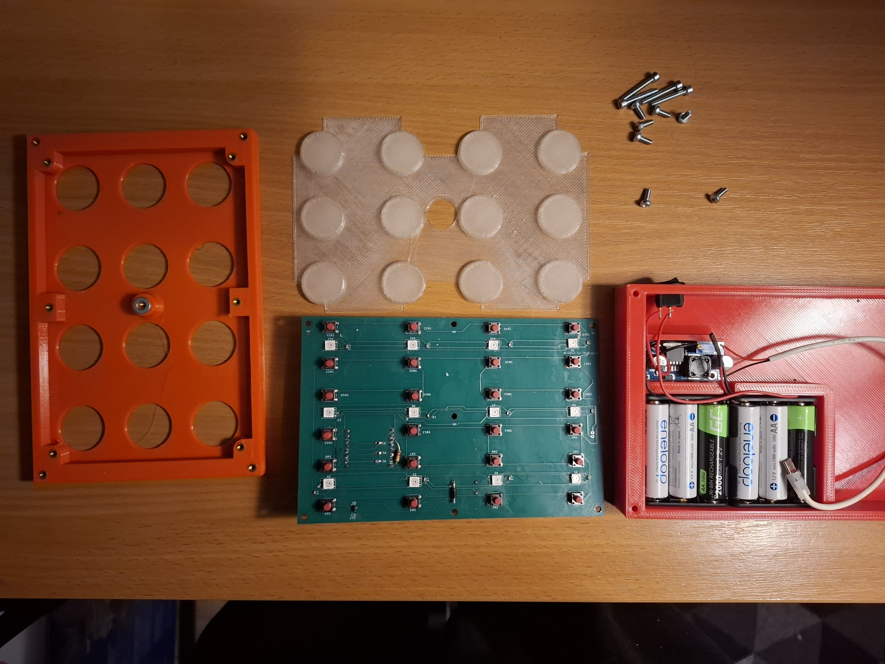
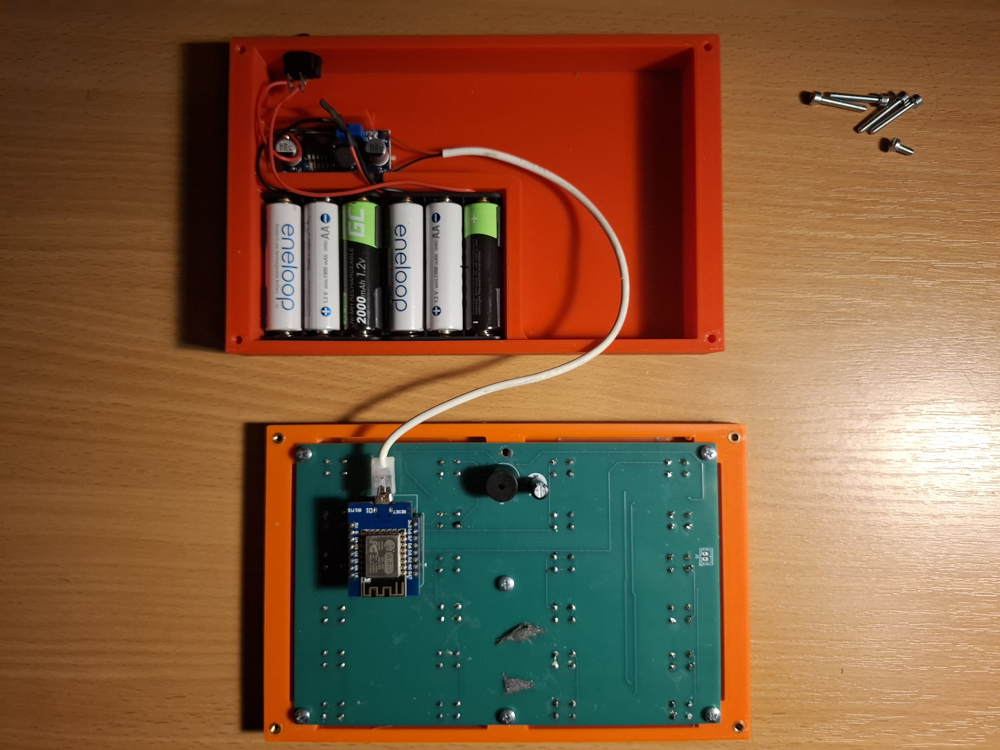
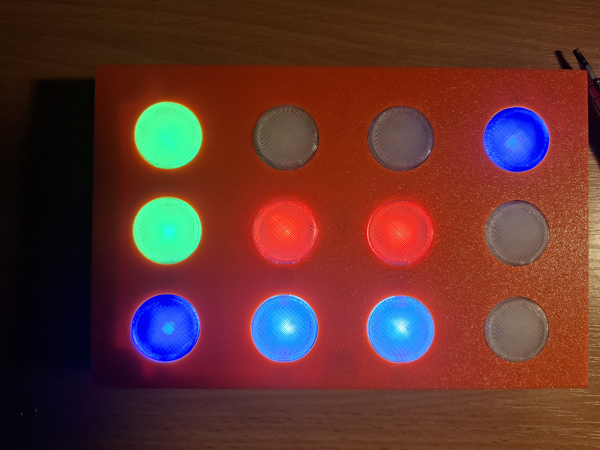

# ColorMemo

An open-source, handheld color memory game built around a WeMos D1 mini (ESP8266), a 3×4 push-button matrix, a 12‑pixel NeoPixel (WS2812) LED array, and a small buzzer. 
Power it up, memorize the brief color reveal, and then flip tiles two at a time to find matching pairs. Clear the board to win and enjoy the victory animation and melody.

## Photos

Below are a few snapshots of the prototype and assembly. Images are stored in `Photos/`.

  
  
  

## Repository structure

- `Firmware/` — PlatformIO project with Arduino firmware for ESP8266 (D1 mini lite) using Adafruit NeoPixel.
- `KiCad/` — Complete PCB design (schematic, PCB, STEP) and production files (`gerber/`).
- `3DPrint/` — 3D printable parts for enclosure and/or fixtures.
- `Cad/` — Additional mechanical CAD sources.
- `Photos/` — Renders or placement guides.
- `LICENSE` — Project license.

## Hardware overview

- MCU: WeMos D1 mini lite (ESP8266)
- LEDs: 12× WS2812/NeoPixel (strip or array)
- Inputs: 12 momentary push buttons arranged as a 3×4 matrix (row/column scanned)
- Audio: Passive buzzer for tones and win melody

The firmware scans a 3×4 button matrix while driving a 12‑LED NeoPixel strip. On boot, it shuffles 6 color pairs, briefly reveals all 12 tiles with tones, and then hides them. Press two buttons; if the colors match, they stay lit. Match all pairs to win.

### Pinout (D1 mini lite)

- NeoPixel DIN: D1 (GPIO5)
- Buzzer: D2 (GPIO4)
- Button matrix rows (outputs):
  - ROW0: D8 (GPIO15)
  - ROW1: D3 (GPIO0)
  - ROW2: D4 (GPIO2)
- Button matrix columns (inputs with pull‑ups):
  - COL0: D0 (GPIO16)
  - COL1: D7 (GPIO13)
  - COL2: D6 (GPIO12)
  - COL3: D5 (GPIO14)
- A0 (ADC) is sampled at boot to add entropy for shuffling.

Notes:
- Columns use `INPUT_PULLUP`; a pressed button reads LOW when its row is driven active (LOW).
- The firmware maps physical grid positions to LED indices to keep the visual grid coherent.

### Bill of materials (BOM)

- KiCad BOM
- 2x3AA battery holder
- Cheap step down LM965 
- USB cable to cut 

## Firmware

The firmware lives in `Firmware/` and is a PlatformIO project.

- Board environment: `d1_mini_lite`
- Platform: `espressif8266`
- Framework: `arduino`
- Dependency: `Adafruit NeoPixel`

### Quick start (PlatformIO CLI)

1. Install PlatformIO Core (CLI): https://platformio.org/install/cli
2. From the repository root (or `Firmware/`):
   - Build: `pio run -e d1_mini_lite`
   - Upload (adjust serial port if needed): `pio run -e d1_mini_lite -t upload`
   - Serial monitor (optional): `pio device monitor`

Alternatively, use the PlatformIO IDE extension in VS Code and pick the `d1_mini_lite` environment.

## PCB and fabrication

- Open `KiCad/ColorMemo/ColorMemo.kicad_pro` in KiCad 7+
- You need to handsolder 

## 3D printing

3MF are available in `./cad`. Source is available in OnShape https://cad.onshape.com/documents/b4ecd71daf39ea8c1ed2c249/w/92a4c2cfa870c08fc1134c94/e/b7d8f3f5da42c53fd1b61ef6.

## How to play

1. Power on: all 12 tiles briefly reveal colors with tones.
2. Press a button to reveal a tile; press a second button to reveal another.
3. If they match, both remain lit. If not, they hide after a short delay.
4. Match all pairs (6 pairs total) to trigger the win animation + melody.

## Project status

- Working prototype firmware and hardware files are present.

## License

This project is licensed under the terms in `LICENSE`.

## Acknowledgements

- Adafruit NeoPixel library (MIT): https://github.com/adafruit/Adafruit_NeoPixel
- PlatformIO ecosystem for painless embedded builds
